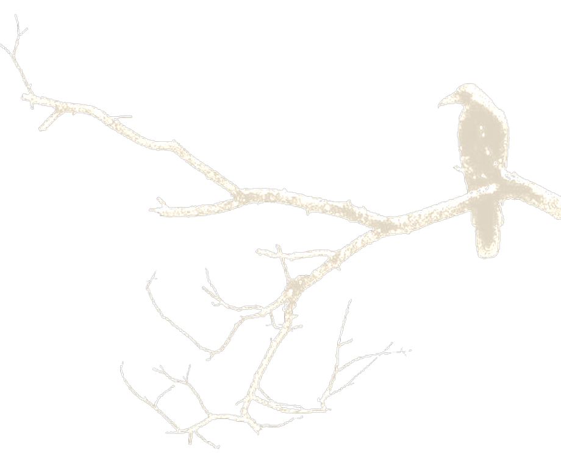
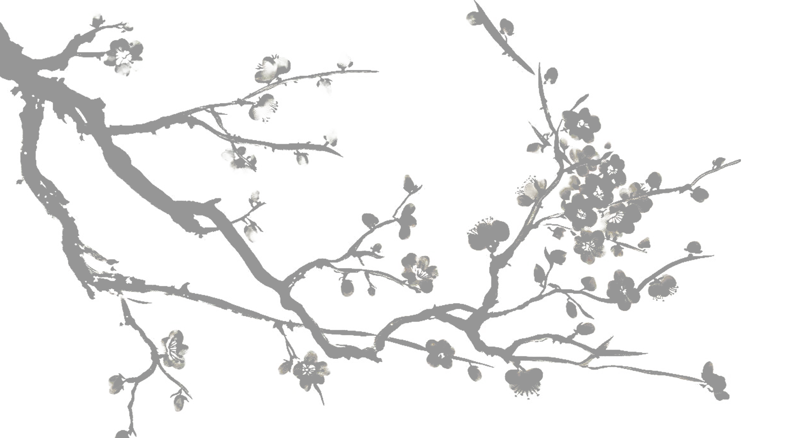

 

<h3 align="center">Hello! My name is Vinycius Alves</h3>

 

I'm Vinycius Alves, a student of Systems Analysis and Development at the Federal Institute of Piauí – Campus Pedro II.  Areas of Interest      Website development     App development  Goals  Expand my knowledge in technology Apply this knowledge to future projects Become a full-stack developer

###

<h2 align="left">Technologies</h2>

###

  
  
  
  
  
  
  
  
  

<h2 align="left">Studying</h2>

  
  
  
  

<h2 align="left">Stats</h2>

  
  

<picture align="right">
  <source media="(prefers-color-scheme: dark)" srcset="https://raw.githubusercontent.com/VINYCIU51/VINYCIU51/output/github-contribution-grid-snake-dark.svg">
  <source media="(prefers-color-scheme: light)" srcset="https://raw.githubusercontent.com/VINYCIU51/VINYCIU51/output/github-contribution-grid-snake.svg">
  
</picture>
